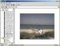



## CamEVU \- Webcam Viewing Utility

### Description

This is the source code to my open source, freeware cam viewing utility - CamEVU. It's meant to allow users the ability to view webcams through this application rather than having to have a bunch of Internet browsers open sucking up system resources. It's not for everyone, but some people (including myself) find it useful. Let me know what you think! Updated June 13, 2001.
 
### More Info
 
WindowsXP has some sizing issues with CamEVU. I will be updating CamEVU when I get my hands on RC1 to fix these issues.

             |
---                |---
**Submitted On**   |2001-04-28 18:50:20
**By**             |[Evan C\. Sims](https://github.com/Planet-Source-Code/PSCIndex/blob/master/ByAuthor/evan-c-sims.md)
**Level**          |Intermediate
**User Rating**    |4.5 (50 globes from 11 users)
**Compatibility**  |VB 5\.0, VB 6\.0
**Category**       |[Internet/ HTML](https://github.com/Planet-Source-Code/PSCIndex/blob/master/ByCategory/internet-html__1-34.md)
**World**          |[Visual Basic](https://github.com/Planet-Source-Code/PSCIndex/blob/master/ByWorld/visual-basic.md)
**Archive File**   |[CamEVU \- W211176132001\.zip](https://github.com/Planet-Source-Code/evan-c-sims-camevu-webcam-viewing-utility__1-24065/archive/master.zip)

